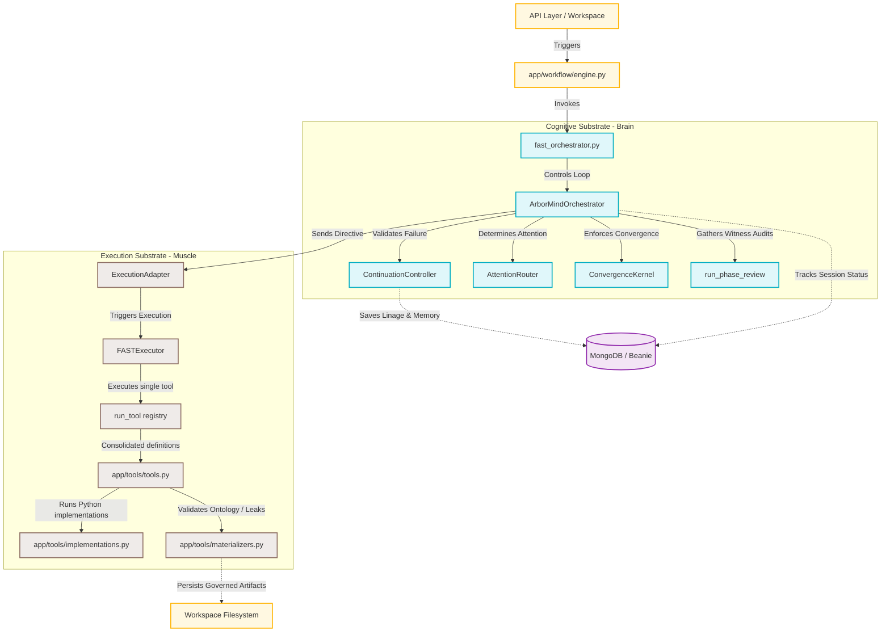

# GenxAI Studio - Modern Backend Dependency & Import Graph

This document details the authoritative active runtime topology of the GenxAI Studio V3 backend following the safe cleanup and quarantine of dead legacy systems.

---

## 🎭 Authoritative Runtime Topology (ArborMind + FAST)

The following dependency graph illustrates the clean division of responsibilities: **ArborMind** acts as the high-level cognitive brain (planning, validations, and decisions), while **FAST** acts as the execution muscle (executing individual tools programmatically).

---

## 🗄️ Quarantined Legacy Modules Map

To ensure **100% rollback capability** and historical visibility, all dead legacy components have been quarantined under `Backend/legacy_archive/` instead of permanent deletion.

| Quarantined Path | Functional Category | Replacement Mechanism in ArborMind / FAST |
| :--- | :--- | :--- |
| `legacy_archive/handlers/` | Dead step handlers (`architecture.py`, `backend_models.py`, `testing_backend.py`, etc.) | Replaced by high-level LLM capabilities directly orchestrated inside the `ArborMindOrchestrator` using consolidate `tools.py` tools (like `subagentcaller`). |
| `legacy_archive/supervision/` | Obsolete supervisor & quality gates | Replaced by `app/orchestration/phase_review.py` (Marcus review as a post-phase witness audit) which directly saves observations without stopping execution. |
| `legacy_archive/tools/migration.py` | Legacy wrapper for old step handlers | Replaced by `FASTExecutor.execute_once()`, which executes fully resolved single-tool requests directly. |
| `legacy_archive/tools/planner.py` | Old linear plan builder | Replaced by ArborMind's cognitive loop, which plans and handles branches via persistent SQLite FailureMemory and Attention. |
| `legacy_archive/tools/planning.py` | Old linear planning definitions | Replaced by ArborMind persistent lineges (`sqlite_lineage_store.py`). |
| `legacy_archive/tools/executor.py` | Old linear plan executor | Replaced by the `FASTExecutor`. |
| `legacy_archive/utils/component_copier.py` | UI component discovery and copier | Obsolete. Shadcn and UI elements are now copied directly via the seed templates during initial project scaffolding. |
| `legacy_archive/utils/dependency_fixer.py` | Dynamic requirements.txt generator | Obsolete. Startup preflight checks enforce strict dependencies via `app/core/preflight/validators.py`. |
| `legacy_archive/utils/integration_playbooks.py`| Obsolete system integration strategies | Replaced by deterministic Python wiring in the active `system_integration.py` handler. |
| `legacy_archive/utils/test_scaffolding.py` | Obsolete test file scaffolds | Replaced by LLM test generation using `sub_agents.py` and `call_llm_with_usage`. |
| `legacy_archive/utils/ui_beautifier.py` | Frontend code format wrapper | Bypassed. Formatting is now governed directly by Vite configurations inside Vite/React workspaces. |
| `legacy_archive/orchestration/router_utils.py` | Redundant route import checker | Bypassed. Bypassed by `wiring_utils.py` which provides robust, idempotent regex and AST-validated insertions. |
| `legacy_archive/core/auth_boundary.py` | Old authentication rules | Bypassed. Prompt engineering templates inside `derek.py` and dynamic context filters enforce this natively. |
| `legacy_archive/validation/static_validator.py` | Obsolete static evidence checker | Replaced by active syntax/compilation checking in `app/validation/syntax_validator.py`. |
| `legacy_archive/tracking/metrics.py` | Redundant metrics generator | Replaced by centralized token and budget tracking in `app/orchestration/budget_manager.py`. |
| `legacy_archive/tracking/quality.py` | Obsolete quality tracking | Replaced by `app/orchestration/review_report.py`. |
| `legacy_archive/llm/prompts/` | Quarantined testing prompts | Replaced by dynamic prompts and unified repair mode templates inside `app/llm/prompts/`. |

---

## 🛡️ Active Integrity Locks

The following modules look like they could be legacy, but are **ACTIVE CRITICAL INFRASTRUCTURE** and have been strictly preserved:
1.  **`app/core/step_invariants.py`**: Required by our exception classifier `app/core/failure_boundary.py`.
2.  **`app/core/llm_output_integrity.py`**: Enforces chunk/completion integrity on raw model streams.
3.  **`app/validation/syntax_validator.py`**: Used by AST checkers to block writing syntactically broken code.
4.  **`app/handlers/base.py`**: Provides active Websocket broadcast structures for frontend terminal logging.
