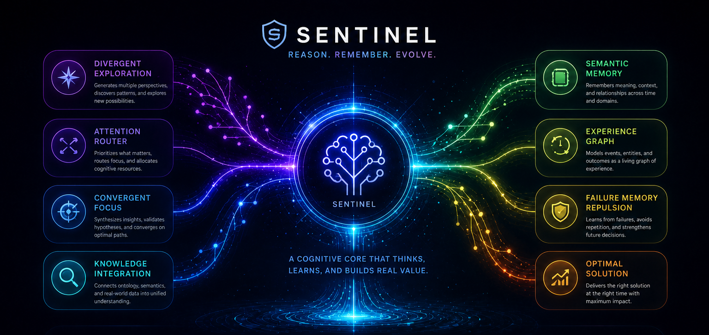

<div align="center">
  

  <h1>GenxAI Studio V4</h1>
  <p><strong>The Next-Generation Agentic Coding Environment</strong></p>

  <p>
    <a href="#features">Features</a> •
    <a href="#sentinel-architecture">Sentinel</a> •
    <a href="#getting-started">Getting Started</a> •
    <a href="#benchmarks">Benchmarks</a>
  </p>
</div>

---

## 🌟 Overview

**GenxAI Studio V4** is a revolutionary AI-powered development environment designed to build, refactor, and manage codebases autonomously. Powered by the **Sentinel Cognitive Architecture**, it doesn't just generate code—it understands, verifies, repels failures, and iteratively repairs applications until they reach deterministic perfection.

<div align="center">
  
</div>

---

## ✨ Features

- **Autonomous Workspace Generation**: Generate full-stack applications (Frontend + Backend) from simple conversational intents.
- **AST-Aware Projection**: Manipulate code at the Abstract Syntax Tree level for surgical precision.
- **Cognitive Faculties**: Sub-agents like *Victoria* (UI), *Derek* (API), *Luna* (Database), and *Reggie* (Workflow) collaboratively design the universe of thought.
- **Immutable Execution Kernel**: Transactions are safely committed, verified, and rolled back if they breach integrity.
- **Real-time Telemetry & Visualization**: Track the AI's internal cognition, memory hits, and cluster analyses in real-time.

---

## 🧠 The Sentinel Architecture

<div align="center">
  
</div>

# Sentinel

Sentinel is the recursive cognitive engine that powers GenxAI Studio.

Unlike traditional AI coding systems that follow a fixed sequence of generation steps, Sentinel operates as a continuously self-correcting cognitive loop. It explores architectural possibilities, evaluates them against governance and verification constraints, learns from failures, and recursively searches for more stable solutions.

At its core, Sentinel is built around four foundational systems:

* **Governance** — Determines whether a topology should be accepted, repaired, or rejected.
* **Verification** — Measures structural, runtime, visual, and architectural integrity.
* **Memory** — Stores validated experiences and failure patterns for future reasoning.
* **Universe of Thought (UoT)** — Explores alternative architectural possibilities through branch expansion and mutation.

## Core Cognitive Loop

### Projection

Sentinel generates and projects a candidate topology into a staging environment through the AST Projector.

### Verification

The projected topology is evaluated through multiple verification layers including dependency integrity, state tracing, build validation, runtime validation, visual validation, and topology cohesion.

### Failure Analysis

Verification failures are converted into structured failure fingerprints and analyzed as cognitive signals rather than terminal errors.

### Governance (Marcus)

Marcus evaluates the discovered failures and determines whether they represent a recoverable condition (**REPAIR**) or a terminal condition (**REJECT**).

### Candidate Memory

Failures approved for repair are recorded as candidate memories. These experiences remain untrusted until a successful repair cycle validates them.

### Universe of Thought Expansion

Sentinel's faculties generate multiple architectural mutations and alternative topologies designed to overcome the detected failures.

### Branch Evaluation

Each candidate branch is evaluated using governance scores, convergence metrics, complexity analysis, and failure-memory repulsion.

### Selection

The most stable candidate topology is selected for the next projection cycle.

### Recursive Recovery

The selected topology re-enters projection and verification. This process continues until a stable solution emerges or governance terminates the search.

### Memory Commitment

Only successful recovery paths are promoted from candidate memory into committed memory.

### Validation & Telemetry

Every cycle is recorded in `sentinel_validation.db`, enabling measurement of governance effectiveness, memory usefulness, branch quality, failure distributions, and overall system performance.

---

## Philosophy

Sentinel is built on a simple principle:

**Not every experience deserves memory.**

Failures are not automatically learned. Experiences must survive governance review, demonstrate utility through successful recovery, and prove their value before becoming part of Sentinel's long-term knowledge.

This prevents memory pollution, reduces failure repetition, and allows the system to evolve through validated experience rather than raw accumulation.


## Objective

The objective of Sentinel is not merely to generate software.

The objective is to discover, verify, repair, and converge toward increasingly stable software architectures through recursive cognitive search.

---

## 🚀 Getting Started

### Prerequisites
- **Python 3.10+**
- **Node.js 18+**
- **MongoDB**

### 1. Start the Backend

```bash
cd Backend
python -m venv .venv
.\.venv\Scripts\activate
pip install -r requirements.txt

# Start the uvicorn server
uvicorn app.main:app --reload
```

### 2. Start the Frontend

```bash
cd Frontend
npm install
npm run dev
```

<div align="center">
  <p>Built with ⚡ by <strong>GenxAI Labz</strong></p>
</div>
