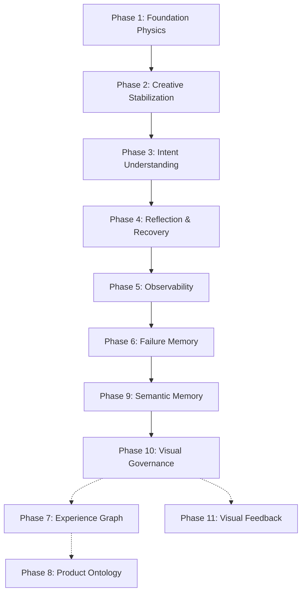

# Sentinel Architecture & Implementation Roadmap

**Sentinel** represents the cognitive core (the **"Brain"**) of the GenxAI Labz ecosystem. It is dedicated strictly to high-level reasoning, planning, multi-dimensional search exploration, safety governance, runtime self-reflection, and self-healing.

Sentinel operates completely independent of visual design paradigms, layout hierarchies, framework boundaries (e.g. React/Flutter), or design aesthetics. 

---

## The Core Philosophy
> [!IMPORTANT]
> **Sentinel is Visual-Agnostic.**
> Sentinel does not reason about Glassmorphism, Bento Grids, modern SaaS templates, dashboard styling, grids, margins, or padding. Those belong to GenxAI Studio. Sentinel reasons about pure logical intention, semantic schemas, and operational constraints.

---

## Phase-by-Phase Implementation Status

### ✅ Phase 1 — Foundation Physics (Status: Complete)
* **Objective**: Define core physics engine constraints, topology domains, and boundary parameters.
* **Core Primitives**:
  - `NodeType` structures and relationships.
  - Multi-dimensional failure geometries.
  - Domain separation layers and envelope containment checks.
* **Key Files**:
  - `Backend/app/sentinel/topology/node_types.py`
  - `Backend/app/sentinel/physics/failure_geometry.py`

### ✅ Phase 2 — Creative Stabilization (Status: Complete)
* **Objective**: Prevent structural divergence, enforce hard/soft topological constraints, and optimize graph densities.
* **Core Primitives**:
  - Distance preservation and force-directed stabilization routing.
  - Automatic density protection thresholds.
  - Graph pruning and node compression algorithms.
* **Key Files**:
  - `Backend/app/sentinel/topology/arbor_core.py`
  - `Backend/app/sentinel/topology/topology_compression.py`

### ✅ Phase 3 — Intent Understanding (Status: Complete)
* **Objective**: Parse raw natural language intentions into semantic intent trees.
* **Core Primitives**:
  - Lightweight intent semantics parsing (Verb/Target Extraction).
  - Intent anchoring schemas mapping capabilities directly to ontological entities.
* **Key Files**:
  - `Backend/app/sentinel/cognition/intent_parser.py`

### ✅ Phase 4 — Reflection & Recovery (Status: Complete)
* **Objective**: Real-time self-critique, correction loops, and self-healing systems.
* **Core Primitives**:
  - Closed-loop reflection.
  - Back-off and step decay algorithms.
  - Automatic topology correction and recovery rules.
* **Key Files**:
  - `Backend/app/sentinel/cognition/mutation_engine.py`

### ✅ Phase 5 — Observability (Status: Complete)
* **Objective**: Deep logging, traceback recording, and step survival metrics.
* **Core Primitives**:
  - Detailed projection metrics tracking.
  - Partial graph projection survival (preventing complete collapses during mutations).
* **Key Files**:
  - `Backend/app/sentinel/observability/projection_metrics.py`
  - `Backend/app/sentinel/observability/ast_projector.py`

### ⚡ Phase 6 — Failure Memory Foundation (Status: In Progress)
* **Objective**: Persistent historical intelligence and automated error learning.
* **Core Primitives**:
  - Persistent SQLite failure logging (`sentinel_memory.db`).
  - Strict taxonomy classification of compilation and semantic failures.
* **Remaining**: Implementing failure learning algorithms to adjust LLM search trajectories based on past SQLite failures.
* **Key Files**:
  - `Backend/app/sentinel/failure_memory/failure_recorder.py`

### ⚡ Phase 9 — Semantic Memory (Status: In Progress / Initial Version Operational)
* **Objective**: Memory-based patterns caching.
* **Current Status**: A lightweight semantic meaning memory database is fully implemented to track semantic intention records.
* **Key Files**:
  - `Backend/app/sentinel/meaning_memory/meaning_recorder.py`
  - `Backend/app/sentinel/meaning_memory/semantic_memory.db`

### ⚡ Phase 10 — Visual Governance (Status: In Progress / Initial Version Operational)
* **Objective**: Enforce multi-dimensional code and design guidelines during validation.
* **Current Status**: Initial Visual Oracle is active inside the validation pipeline, dynamically inspecting Tailwind layouts, TSX code, and alt-tag accessibility.
* **Key Files**:
  - `Backend/app/sentinel/oracles/visual_oracle.py`

---

## Future Sentinel Roadmap (Planned Upgrades)

### 📋 Phase 7 — Experience Graph (Priority: High)
* **Objective**: Model abstract human experience paths prior to visual rendering.
* **Primitives**:
  - `GOAL_NODE`, `FLOW_NODE`, `SCREEN_NODE`, `ACTION_NODE`, `EXPERIENCE_NODE`.

### 📋 Phase 8 — Product Ontology Reasoner (Priority: High)
* **Objective**: Dynamically discover domain models, custom roles, schemas, and workflows directly from intent.
* **Invariant**: 100% template-free generation (e.g. no hardcoded CRM or Kanban frameworks).

### 📋 Phase 11 — Visual Feedback Loop (Priority: Future)
* **Objective**: Visual analysis critique using multi-modal screenshot loops.
* **Pipeline**:
  - `Generate Code` → `Render UI` → `Capture Screenshot` → `Visual Critique` → `Perform Mutation`.
