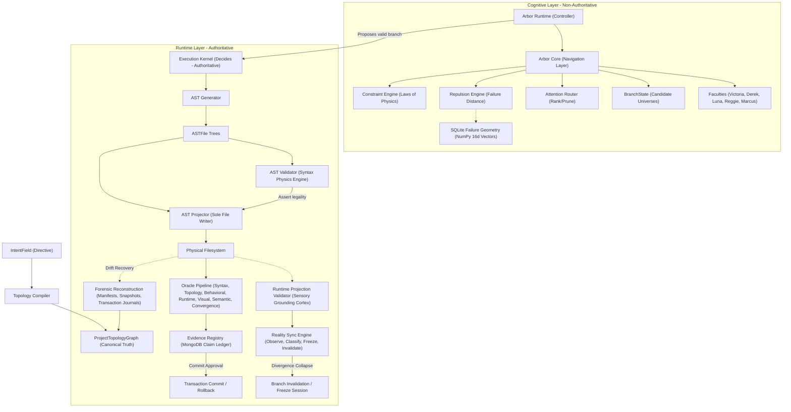

# GenxAI Studio V4 — Clean-Room Refactor Walkthrough

This walkthrough details the structural, syntactic, validation, and cognitive transformations implemented during **Stage 2 (Canonical Topology)**, **Stage 3 (AST Pipeline)**, **Stage 4 (Oracle Layer)**, **Stage 5 (Runtime Synchronization)**, and **Stage 6 (Minimal Cognition)** of the clean-room V4 refactor.

---

## 1. Accomplishments Overview

We have successfully shifted the system's core paradigm from a file-centric, retry-healing prompt loop (V3) to a strict, governed **Topology → AST → Filesystem** projection flow, certified at every stage by a multi-layer verification hierarchy and grounded in real-time, non-cognitive continuous synchronization. 

By completing **Stage 6 (Minimal Cognition)**, we have locked in a bounded adaptive search engine that explores candidate universes in parallel non-authoritative branches, while keeping execution and transaction truth entirely external to cognition.



---

## 2. Changes Made & Implementations

### Stage 2: Canonical Topology [COMPLETE ✅]
* **[node_types.py](file:///c:/Users/JARVIS/Desktop/GenxAI%20Studio%20V4/Backend/app/topology/node_types.py)**: Ontological boundary schema mapping permitted mutation classes and allowed file destinations.
* **[project_graph.py](file:///c:/Users/JARVIS/Desktop/GenxAI%20Studio%20V4/Backend/app/topology/project_graph.py)**: Master topology DAG with automated cryptographic node-level and graph-level integrity hashes.
* **[directive.py](file:///c:/Users/JARVIS/Desktop/GenxAI%20Studio%20V4/Backend/app/models/directive.py)**: Boundary-based semantic `IntentField` governing emergent designs via constraints and pressure fields.
* **[topology_compiler.py](file:///c:/Users/JARVIS/Desktop/GenxAI%20Studio%20V4/Backend/app/topology/topology_compiler.py)**: Converts `IntentField` boundaries directly into populated topology graphs without disk access.
* **[topology_validator.py](file:///c:/Users/JARVIS/Desktop/GenxAI%20Studio%20V4/Backend/app/topology/topology_validator.py)**: Mathematical physics checker identifying cyclic imports/dependencies and illegal component edges.
* **[structural_diff.py](file:///c:/Users/JARVIS/Desktop/GenxAI%20Studio%20V4/Backend/app/topology/structural_diff.py)**: Detects graph mutations, classifies diff Tiers, and calculates stability convergence metrics.
* **[topology_version_manager.py](file:///c:/Users/JARVIS/Desktop/GenxAI%20Studio%20V4/Backend/app/topology/topology_version_manager.py)**: Manages branches and lineage history committed directly to MongoDB via Beanie.

### Stage 3: AST Pipeline [COMPLETE ✅]
* **[ast_generator.py](file:///c:/Users/JARVIS/Desktop/GenxAI%20Studio%20V4/Backend/app/topology/ast_generator.py)**: Synthesizes high-level `ASTFile` configurations (imports, classes, FastAPI endpoints, React TSX components) deterministically from topology graphs.
* **[ast_mutator.py](file:///c:/Users/JARVIS/Desktop/GenxAI%20Studio%20V4/Backend/app/topology/ast_mutator.py)**: Implements scope-aware and node-aware structural surgery on AST syntax trees (no blind text regex patches).
* **[ast_merger.py](file:///c:/Users/JARVIS/Desktop/GenxAI%20Studio%20V4/Backend/app/topology/ast_merger.py)**: Deterministically reconciles and merges syntax nodes, aggregates imports, and updates definitions.
* **[ast_validator.py](file:///c:/Users/JARVIS/Desktop/GenxAI%20Studio%20V4/Backend/app/topology/ast_validator.py)**: Deterministic syntax correctness compilation checks, balanced TSX tag matching, and forbidden target guards.
* **[ast_projector.py](file:///c:/Users/JARVIS/Desktop/GenxAI%20Studio%20V4/Backend/app/topology/ast_projector.py)**: The **SOLE** writer allowed to modify files on disk, ensuring all filesystem writes are completely projection-controlled.

### Stage 4: Oracle Layer [COMPLETE ✅]
We have introduced a rigorous **Oracle Hierarchy** separating **HARD Physics** (absolute system compile, dependency, and routing legality) from **SOFT Advisories** (layout warnings, intent alignment, and entropy growth).
* **[base.py](file:///c:/Users/JARVIS/Desktop/GenxAI%20Studio%20V4/Backend/app/oracles/base.py)**: Modular interface for hard vs soft oracle validations.
* **[syntax_oracle.py](file:///c:/Users/JARVIS/Desktop/GenxAI%20Studio%20V4/Backend/app/oracles/syntax_oracle.py) [HARD]**: Asserts correct compilation physics, AST parsing, and import validity on disk.
* **[topology_oracle.py](file:///c:/Users/JARVIS/Desktop/GenxAI%20Studio%20V4/Backend/app/oracles/topology_oracle.py) [HARD]**: Asserts graph DAG acyclic legality and filesystem manifest congruence.
* **[behavioral_oracle.py](file:///c:/Users/JARVIS/Desktop/GenxAI%20Studio%20V4/Backend/app/oracles/behavioral_oracle.py) [HARD]**: Verifies full reachability path routing, database model connections, and component binds.
* **[runtime_oracle.py](file:///c:/Users/JARVIS/Desktop/GenxAI%20Studio%20V4/Backend/app/oracles/runtime_oracle.py) [HARD]**: Sandboxes physical E2E/unit test runs inside the active branch directory.
* **[visual_oracle.py](file:///c:/Users/JARVIS/Desktop/GenxAI%20Studio%20V4/Backend/app/oracles/visual_oracle.py) [SOFT]**: Structural layout, responsive containers, accessibility, and Tailwind class spellchecker.
* **[semantic_oracle.py](file:///c:/Users/JARVIS/Desktop/GenxAI%20Studio%20V4/Backend/app/oracles/semantic_oracle.py) [SOFT]**: Tracks intent field drift invariants.
* **[convergence_oracle.py](file:///c:/Users/JARVIS/Desktop/GenxAI%20Studio%20V4/Backend/app/oracles/convergence_oracle.py) [SOFT]**: Monitors entropy gradients and system exploration stagnation limits.

### Stage 5: Runtime Synchronization [COMPLETE ✅]
We have locked in sensory continuous validation, strict reality synchronization boundaries, and forensic non-cognitive reconstruction to prevent split-brain state mutations.
* **[runtime_projection_validator.py](file:///c:/Users/JARVIS/Desktop/GenxAI%20Studio%20V4/Backend/app/runtime/runtime_projection_validator.py)**: Sensory Grounding Cortex continuously checking filesystem congruence score, file mismatch states, and manifest presence.
* **[reality_sync.py](file:///c:/Users/JARVIS/Desktop/GenxAI%20Studio%20V4/Backend/app/runtime/reality_sync.py)**: Authoritative reality bridge checking active leases and database/manifest synchronization. Enforces the strict **Reality Authority Law**.
* **[reconstruction.py](file:///c:/Users/JARVIS/Desktop/GenxAI%20Studio%20V4/Backend/app/runtime/reconstruction.py)**: Disaster recovery engine reconstructs topology graphs forensically and deterministically strictly from disk manifest files, pre-cycle snapshot data, and database transaction commit logs. **No cognitive/LLM hallucination is allowed.**
* **Cryptographic Chained Chaining**: Formulates locked system integrity hashes chained to preceding transaction commit history:
  $$H_{\text{system}} = \text{SHA-256}(H_{\text{topology}} \mathbin{\Vert} H_{\text{ast}} \mathbin{\Vert} H_{\text{filesystem}} \mathbin{\Vert} H_{\text{prev\_tx\_hash}})$$

### Stage 6: Minimal Cognition [COMPLETE ✅]
We have fully implemented the bounded branch exploration layer, guaranteeing that cognition may explore possibility spaces but NEVER directly define reality.
* **[patch_ir.py](file:///c:/Users/JARVIS/Desktop/GenxAI%20Studio%20V4/Backend/app/cognition/patch_ir.py)**: Structured intermediate representation payload detailing topological changes (no raw text code generation).
* **[constraint_engine.py](file:///c:/Users/JARVIS/Desktop/GenxAI%20Studio%20V4/Backend/app/cognition/constraint_engine.py)**: Logical laws of physics inside ArborMind, blocking any Tier 5 Forbidden Mutation attempt or invariant/workflow state breach.
* **[branch.py](file:///c:/Users/JARVIS/Desktop/GenxAI%20Studio%20V4/Backend/app/cognition/branch.py)**: Models candidate universes, ancestry paths, and lineage histories under active exploration.
* **[failure_geometry.py](file:///c:/Users/JARVIS/Desktop/GenxAI%20Studio%20V4/Backend/app/failure_memory/failure_geometry.py)**: Local SQLite failure registry converting traceback and topological failures into 16-dimensional coordinate arrays.
* **[repulsion_engine.py](file:///c:/Users/JARVIS/Desktop/GenxAI%20Studio%20V4/Backend/app/failure_memory/repulsion_engine.py)**: Computes dot-product cosine similarity against historical coordinates, deflecting search away from past failure pathways.
* **[convergence_engine.py](file:///c:/Users/JARVIS/Desktop/GenxAI%20Studio%20V4/Backend/app/cognition/convergence_engine.py)**: Measures graph entropy and calculates stabilization slopes ($\Delta L$) to freeze stable models or flag stagnation.
* **[attention_router.py](file:///c:/Users/JARVIS/Desktop/GenxAI%20Studio%20V4/Backend/app/cognition/attention_router.py)**: Dynamically weights branches and prunes active exploration capacity to budget (max 5 active branches). Routes Marcus's advisory signals strictly as a soft weight modifier.
* **[mutation_engine.py](file:///c:/Users/JARVIS/Desktop/GenxAI%20Studio%20V4/Backend/app/cognition/mutation_engine.py)**: Restricts mutation strictly to event-driven escapes (triggered by oracle blocks or stagnation) rather than recursive perpetual self-improvement.
* **[arbor_core.py](file:///c:/Users/JARVIS/Desktop/GenxAI%20Studio%20V4/Backend/app/cognition/arbor_core.py)**: Cognitive navigation layer orchestrating BFS/DFS traversal over candidate graph trees.
* **[arbor_runtime.py](file:///c:/Users/JARVIS/Desktop/GenxAI%20Studio%20V4/Backend/app/orchestration/arbor_runtime.py)**: Drives parallel branch spawning, routes modifiers, selects the best candidate branch, and invokes the execution kernel projection.
* **[sub_agents.py](file:///c:/Users/JARVIS/Desktop/GenxAI%20Studio%20V4/Backend/app/agents/sub_agents.py)**: Clean-room faculties (Victoria, Derek, Luna, Reggie, Marcus). Marcus operates purely as a soft metacognitive governance analyst with absolute zero execution authority.

---

## 3. Verification & Test Results

All changes are fully certified by a robust suite of 32 automated unit tests across both Stage 1-5 and Stage 6 modules:

```bash
tests\unit\test_stage6_cognition.py ..........                           [ 31%]
tests\unit\test_topology.py ......................                       [100%]

======================= 32 passed, 25 warnings in 1.63s =======================
```

### Covered Stage 6 Tests:
1. `test_constraint_engine_tier5_block`: Asserts that any attempt to mutate kernel-level files or declare Tier 5 mutations is strictly blocked.
2. `test_constraint_engine_invariant_block`: Verifies that mutations violating directive invariants are immediately rejected.
3. `test_branch_cloning_and_tree_spawning`: Asserts proper deep-cloning of graphs and spawning of valid child branches.
4. `test_failure_geometry_encoding_and_sqlite`: Confirms SQLite database insertion and NumPy-based coordinate encoding.
5. `test_repulsion_engine_deflection`: Verifies that repulsion engine successfully calculates cosine similarity and deflection.
6. `test_convergence_engine_entropy`: Validates topological entropy calculations and flatline stagnation detection.
7. `test_attention_router_budget_pruning`: Confirms active branch list budget is strictly capped and low-ranked branches are pruned.
8. `test_marcus_governance_analyst_scoring`: Verifies that Marcus successfully emits soft modifier dictionaries and functions purely non-authoritatively.
9. `test_arbor_core_exploration_pipeline`: Proves the complete exploration and constraint checking trajectory.
10. `test_mutation_engine_escape_proposals`: Verifies that the mutation engine correctly generates escape patches in response to oracle failure feedback.
